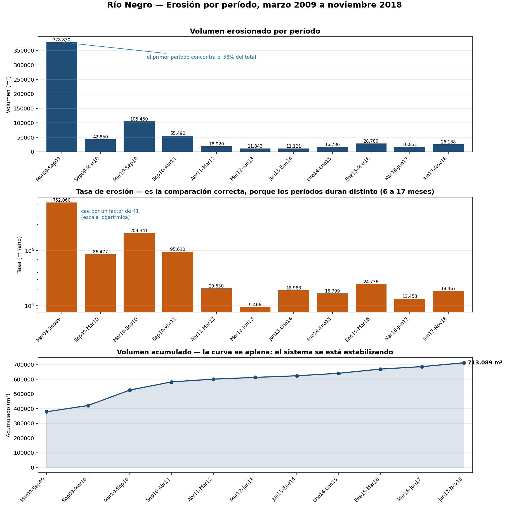
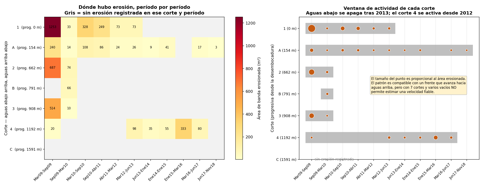
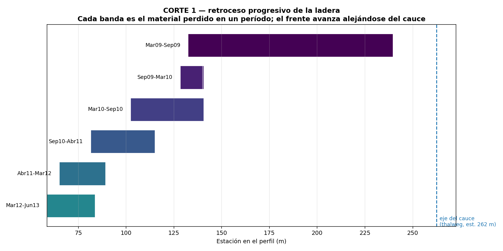
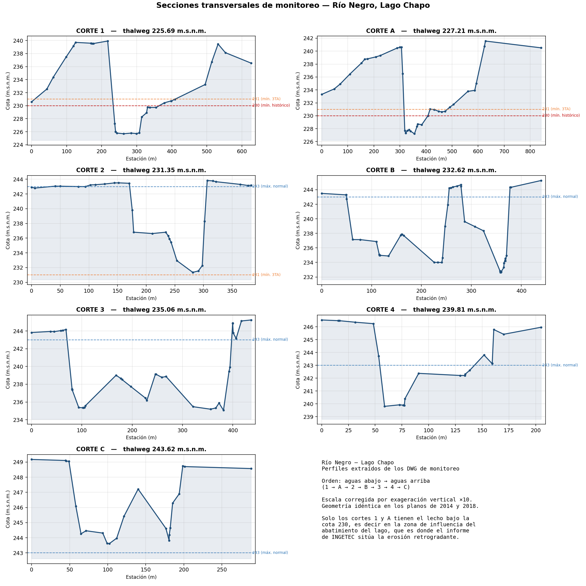

# Lago Chapo — Análisis de erosión del Río Negro

Análisis de los perfiles de monitoreo del Río Negro (7 cortes), en el contexto del
PRDA ordenado por la Sentencia Rol N° D-4-2022 del Tercer Tribunal Ambiental.

## Entregables

| Archivo | Contenido |
|---|---|
| **[`Comparacion_periodos_RioNegro.xlsx`](Comparacion_periodos_RioNegro.xlsx)** | La comparación entre años: 11 períodos con volumen, tasa y acumulado; dónde erosionó cada uno; verificación del método; plantilla de correlación con el nivel del lago |
| **[`Perfiles_RioNegro_analisis.xlsx`](Perfiles_RioNegro_analisis.xlsx)** | Los 7 perfiles extraídos, gráfico por corte, morfometría y progresivas UTM |









## Los datos clave estaban en el paperspace

La leyenda del DWG de 2018 está en el *paperspace* (`Layout1`), no en el modelo, y
declara para cada uno de los **11 períodos** entre marzo 2009 y noviembre 2018: el
color con que se dibujó, la superficie afectada en hectáreas y **el volumen
erosionado en m³**. El perfil de referencia es la *sección original del río según
topografía de marzo 2009*.

El rótulo `Esc Vert 1/300, Hrz 1/3000` confirma la exageración vertical ×10 que se
había deducido midiendo el dibujo.

| # | Período | Meses | Área (ha) | Volumen (m³) | Tasa (m³/año) |
|---|---|---|---|---|---|
| 1 | Mar 09 – Sep 09 | 6.0 | 3.30 | 378 830 | **752 060** |
| 2 | Sep 09 – Mar 10 | 5.9 | 0.44 | 42 850 | 86 477 |
| 3 | Mar 10 – Sep 10 | 6.0 | 0.78 | 105 450 | 209 341 |
| 4 | Sep 10 – Abr 11 | 7.0 | 0.51 | 55 490 | 95 610 |
| 5 | Abr 11 – Mar 12 | 11.0 | 0.20 | 18 920 | 20 630 |
| 6 | Mar 12 – Jun 13 | 15.0 | 0.15 | 11 843 | 9 466 |
| 7 | Jun 13 – Ene 14 | 7.0 | 0.13 | 11 121 | 18 983 |
| 8 | Ene 14 – Ene 15 | 12.0 | 0.24 | 16 786 | 16 799 |
| 9 | Ene 15 – Mar 16 | 14.0 | 0.13 | 28 780 | 24 736 |
| 10 | Mar 16 – Jun 17 | 15.0 | 0.19 | 16 831 | 13 453 |
| 11 | Jun 17 – Nov 18 | 17.0 | 0.34 | 26 188 | **18 467** |
| | **TOTAL** | 116 | **6.41** | **713 089** | 73 748 |

Los períodos duran entre 5.9 y 17 meses, así que la comparación válida es la
**tasa**, no el volumen crudo.

## Es erosión lateral, no incisión del fondo

Dos evidencias: las bandas de cada período están dibujadas *una al lado de otra*
avanzando hacia los costados, y el volumen dividido por la superficie da 7–13 m,
que coincide con la altura de las laderas de los perfiles. La ladera retrocede en
toda su altura.

En el corte 1 el frente retrocedió desde la estación 239 (2009) hasta la 58 (2013),
alejándose del eje del cauce, que está en la estación 262.

## La tasa se desploma

De **752 060 m³/año** en el primer período a **18 467 m³/año** en el último: un
factor de 41. Aun descartando el primer período, cae de 86 477 a 18 467.

Es la firma de un sistema relajándose hacia un nuevo equilibrio: el descenso del
nivel base disparó la erosión, y al erosionar el río fue reduciendo su propia
pendiente, de modo que el proceso se frena solo. Concuerda con la observación del
informe de INGETEC de que el proceso «no parece estar activo o en crecimiento».

## Documentos

| Archivo | Contenido |
|---|---|
| [DIAGNOSTICO.md](DIAGNOSTICO.md) | El análisis: mecanismo causal, balance de Lane aplicado al caso, hipótesis contrastables |
| [EXTRACCION_PERFILES.md](EXTRACCION_PERFILES.md) | Cómo se extrajeron los perfiles de los DWG. Método reproducible |
| [extraer_perfiles_dwg.py](extraer_perfiles_dwg.py) | Extracción DXF → Excel |
| [analisis_perfiles.py](analisis_perfiles.py) | Cálculo de áreas y volúmenes entre campañas |
| [perfiles_rio_negro.csv](perfiles_rio_negro.csv) | Los 7 perfiles en formato tabular (452 filas) |

## En una línea

El abatimiento del nivel del lago baja el nivel base de los afluentes, lo que
aumenta la pendiente del tramo final y desencadena erosión retrogradante. En
términos de Lane: **`Qs·D50 < Q·S`, donde la variable que cambió es S, no Q.**

## Resultados

Los 7 cortes, ordenados de aguas abajo hacia aguas arriba según la cota de su
thalweg (el orden coincide con la progresión espacial de las coordenadas UTM, lo
que lo corrobora):

| Orden | Corte | Thalweg (m.s.n.m.) | Ancho (m) | Relieve (m) | Progresiva (m) |
|---|---|---|---|---|---|
| 1 | **1** | 225.69 | 626 | 14.2 | 0 |
| 2 | **A** | 227.21 | 842 | 14.4 | 154 |
| 3 | **2** | 231.35 | 383 | 12.5 | 662 |
| 4 | **B** | 232.62 | 440 | 12.7 | 791 |
| 5 | **3** | 235.06 | 436 | 10.2 | 908 |
| 6 | **4** | 239.81 | 205 | 6.7 | 1192 |
| 7 | **C** | 243.62 | 288 | 5.6 | 1591 |

**Solo los cortes 1 y A tienen el lecho bajo la cota 230 m.s.n.m.**, es decir en
la zona de influencia del abatimiento del lago. El resto está sobre la cota 231,
el mínimo provisional ordenado por el tribunal. Son precisamente los dos cortes
más cercanos a la desembocadura, y son los que muestran un canal profundamente
encajonado. La geometría es coherente con el mecanismo de erosión retrogradante
descrito en el informe de INGETEC.

El relieve de la sección decrece monótonamente hacia aguas arriba (14.4 → 5.6 m):
secciones encajonadas abajo, someras arriba.

## Qué queda abierto

**El método de cálculo del volumen.** La evidencia apunta a superficie en planta ×
altura de talud, no a áreas medias ni prismoidal entre secciones: el plano informa
hectáreas (medida en planta) y el cociente volumen/superficie da alturas de talud
coherentes. Al recalcular por áreas medias solo coincide el período 2 (−4.4%). Hay
que **pedir la memoria de cálculo**; el método cambia el resultado y debe declararse.

**El primer período.** Declara 378 830 m³ en 6 meses, el 53% del total y 3.5 veces
el segundo más alto. Puede ser real, porque fue el primer levantamiento tras años de
operación sin monitoreo y probablemente arrastra erosión anterior, pero conviene
verificarlo y reportar los resultados con y sin él.

**La hipótesis del frente migrando.** Los cortes 2, 3 y B solo erosionan en
2009–2010; el corte 1 lo hace hasta 2013 y se apaga; el corte 4, situado 1 192 m
aguas arriba, recién se activa en 2012 y culmina en 2015–2016; el corte C nunca. El
patrón es **compatible** con erosión retrogradante, pero no la demuestra: el corte A
sigue activo casi todo el período y la matriz tiene muchos vacíos. El centroide de
la erosión por período resulta errático, no monótono, así que **no se puede estimar
una velocidad de avance fiable** con 7 secciones.

**La correlación con el nivel del lago.** Es el paso pendiente de mayor valor. La
hoja `Nivel_lago` ya tiene las fórmulas: se pegan los niveles diarios y cuenta, por
período, los días bajo las cotas 231 y 230, para graficarlos contra la tasa de
erosión.

## Uso

```bash
pip install -r requirements.txt
python3 extraer_perfiles_dwg.py     # DXF -> Excel
python3 figura_perfiles.py          # figura de los 7 perfiles
python3 analisis_perfiles.py        # autotest del calculo de volumenes
```

La conversión DWG → DXF requiere LibreDWG; los pasos están en
`EXTRACCION_PERFILES.md`.

## Nota metodológica

Los gráficos de perfil de los planos tienen **exageración vertical ×10**. Si no se
corrige, las áreas y volúmenes salen multiplicados por 10. La escala se calibró en
cada gráfico (residuo máximo 0.04 m) y se verificó de forma independiente contra
las coordenadas UTM. Ver la hoja `Calibracion` del Excel.

Para comparar campañas, las áreas nunca se calculan respecto a la cota mínima de
cada perfil: al incidirse el lecho esa cota baja y la referencia se mueve con él,
ocultando el cambio que se busca medir. Se usa datum fijo común o área entre
perfiles.

## Archivos fuente

- `_0895901 -IRF-LBJ-GRAL-0001…Rev B…pdf` — Informe de diagnóstico INGETEC (50 pp.)
- `informe_texto.txt` — texto extraído del anterior, para búsquedas
- `2014 01 Perfiles Monitoreo RNegro b.dwg` — plano enero 2014
- `2018 11 Perfiles Monitoreo RNegro.dwg` / `.pdf` — plano junio 2018
- `PerfilRioNegro.dwg` — perfil longitudinal
